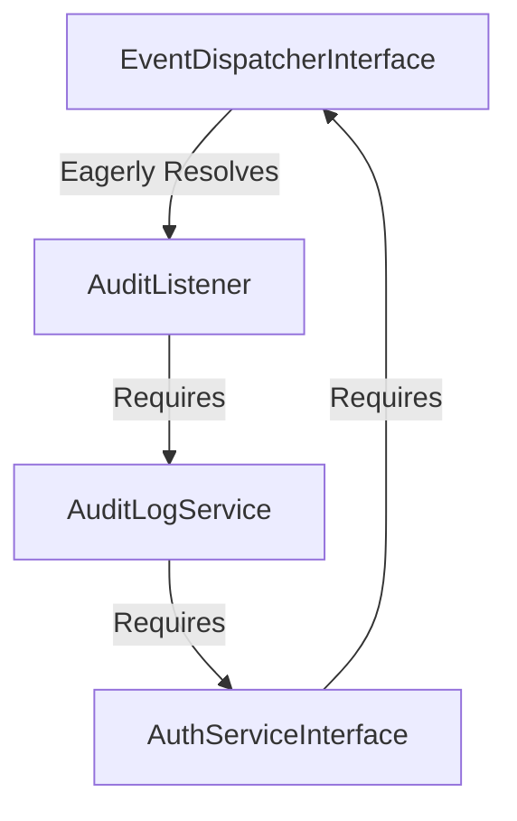

# Dependency Injection & Event Listener Resolution Report

This document compiles the detailed explanations and architectural changes regarding the event listener instantiation lifecycle and the implementation of circular dependency safeguards in **Demoshop's** custom Dependency Injection container.

---

## 1. When Event Listeners are Instantiated

When configuring event listeners in the central `EventDispatcher` (defined in `config/services/events.php`), closures are passed to their `handle` methods:

```php
$dispatcher->addListener(
    OrderPlaced::class, 
    fn($e) => $c->get(OrderListener::class)->handle($e)
);
```

### Registration Phase (No Instantiation)
* During the bootstrapping of the `EventDispatcher`, the anonymous function (closure) is registered in the `$dispatcher->listeners` array.
* The body of the closure—specifically the Dependency Injection container lookup `$c->get(OrderListener::class)`—is **not** executed.
* Therefore, the listener instances themselves are not constructed during application bootstrap or service definition.

### Dispatching Phase (Lazy Instantiation)
* When an event is actually dispatched, the `EventDispatcher` runs:
  ```php
  $listener($event); // Invoking the registered closure
  ```
* This triggers the closure's body, executing `$c->get(OrderListener::class)`.
* Only at this exact moment does the DI container resolve and construct the listener and its dependencies. This ensures unused listeners (for events that never fire during a request) are never instantiated, maximizing performance and reducing memory overhead.

---

## 2. The Original Infinite Loop Issue

When this feature was first developed, registering listeners **eagerly** (retrieving the concrete listener immediately during event dispatcher configuration using `$c->get(Listener::class)`) triggered an **infinite recursion** due to a circular reference in the dependency chain:



### The Breakdown:
1. Resolving **`EventDispatcherInterface`** eager-loaded all listeners, including **`AuditListener`**.
2. **`AuditListener`** required **`AuditLogService`**.
3. **`AuditLogService`** required **`AuthServiceInterface`** (implemented by `AuthService`).
4. **`AuthService`** required **`EventDispatcherInterface`** to dispatch auth events.
5. The container attempted to resolve **`EventDispatcherInterface`** again, initiating an infinite loop.

Since the initial DI container did not check for circular dependencies, it recursively called `get()` until hitting PHP's nesting/memory limit, crashing the application. Wrapping the listener registration in a closure (`fn($e) => ...`) broke the eager resolution cycle.

---

## 3. How to Prevent Future Dependency Loops

To prevent dependency loops in other areas of the application, developers should employ the following strategies:

* **Fast-Failure (Container Safeguards):** Implement active loop detection inside the Dependency Injection container to abort execution with a clear, descriptive error instead of silently exhausting system resources.
* **The Provider Pattern:** Inject a `callable` factory/provider instead of a direct service dependency, deferring resolution until the service is actually utilized.
* **Architectural Decoupling:** If two services have a circular reference, extract their shared concern into a separate, lightweight third service that both can depend on.
* **Event-Driven Pub/Sub:** Decouple direct service-to-service calls by dispatching generic events and handling responses asynchronously.

---

## 4. Implemented Container Safeguard

We updated the custom DI container [Container.php](file:///Users/andy/dev/shop-demo/src/Core/Container.php) to automatically detect circular dependencies and fail fast.

### Safeguard Core Logic:
```php
if (isset($this->resolving[$name])) {
    $path = array_keys($this->resolving);
    $path[] = $name;
    throw new Exception("Circular dependency detected: " . implode(" -> ", $path));
}

$this->resolving[$name] = true;

try {
    // ... resolve service
} finally {
    unset($this->resolving[$name]);
}
```

### Verification
A corresponding unit test was added in `tests/Unit/ContainerTest.php` ensuring that circular lookups throw the expected `Exception` rather than looping indefinitely. All 267 unit tests pass successfully.
